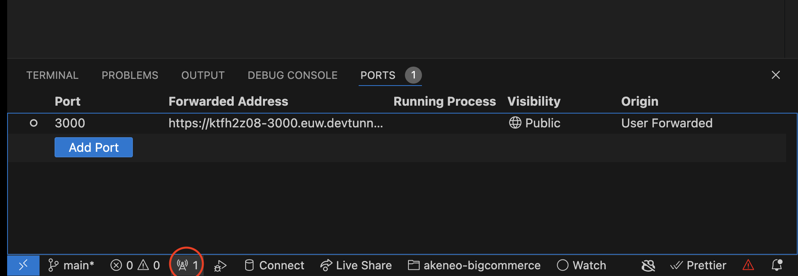

# Akeneo Bigcommerce Connector


## Overview
This is a POC to sync Akeneo and BigCommerce. The goal is to create a product in an Akeneo  and to create a equivalent product in Bigcommerce.

For this:

- Akeneo allows you to set up a webhook to receive notification about product events.
  
- Connection in akeneo sandbox: [dev-sync-test](https://recharge-dev.cloud.akeneo.com/#/connect/connection-settings)

- The [Events API reference of Akeneo](https://api.akeneo.com/events-reference/events-reference-serenity/products.html#) shows the possible events related to products. This means that changes in other entities like categories, channels, or denominations should be polled or received in some other way.

- Akeneo has a GraphQL API, a REST API and a PHP SDK. 
- There is an Akeneo playground to try their [GraphQL API](https://graphql.sdk.akeneo.cloud/).
- I also added a GraphQL client to this repo but it's not necesary for the POC so far.
In the folder `/.akeneo` There is a GraphQL client autogenerated using [this](https://the-guild.dev/graphql/codegen). I tried setting up an automatic updates for the token in the client using [this](https://commerce.nearform.com/open-source/urql/docs/advanced/authentication/) but I couldn't make it work and given that I didn't need to complete the POC I just added a script to get the token and I used that one to create a basic query.
In the folder `/.akeneo` There is a GraphQL client autogenerated using [this](https://the-guild.dev/graphql/codegen). I tried setting up an automatic updates for the token in the client using [this](https://commerce.nearform.com/open-source/urql/docs/advanced/authentication/) but I couldn't make it work. A token can be created manually in their playgraound or using a script. And then then .env file has to be updated with that token.
  
## Getting Started

1)   Install bun

```bash
curl -fsSL https://bun.sh/install | bash # for macOS, Linux, and WSL
```

2) Clone the repository

3) cd akeneo-bigcommerce

4) Once in the folder, install the dependencies running
```bash
bun i
```
5) Get the .env file from 1Password:

[1Password env file](https://start.1password.com/open/i?a=62FZE7OXTVE3HFUUBRVB4F7W7U&v=etilcrxgjoacnxov7pa3e6v4j4&i=3gtovzxdro34xokw5pnbgu2iky&h=team-rechargecom.1password.eu)

6) To start the server run

```
bun index.ts
```

7) Once the server is running, enable the port using vscode by clicking on the ports icon at the activity bar. Once you expose your port, change the visibility from `private` to `public`:



8) Now update the endpoint in the connection configuration to point to the obtained url, in my case is:

`https://ktfh2z08-3000.euw.devtunnels.ms/events`

9) 